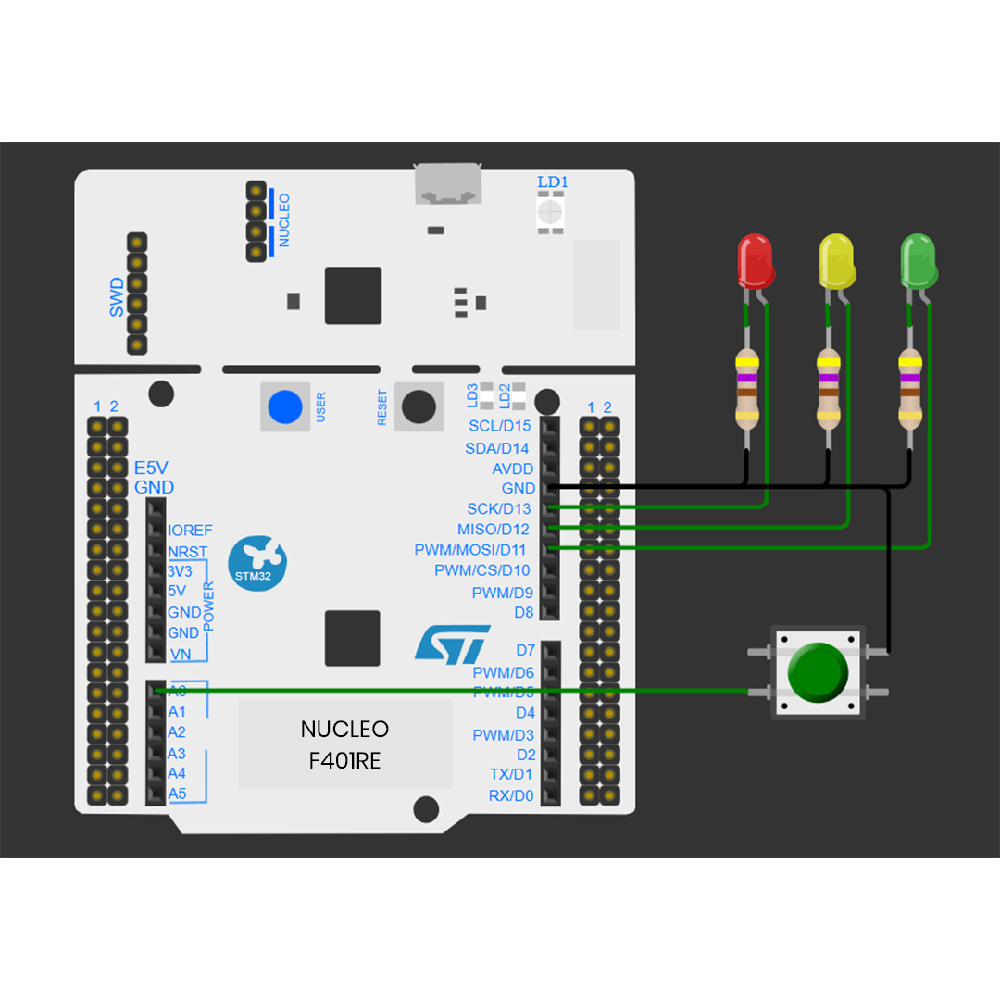
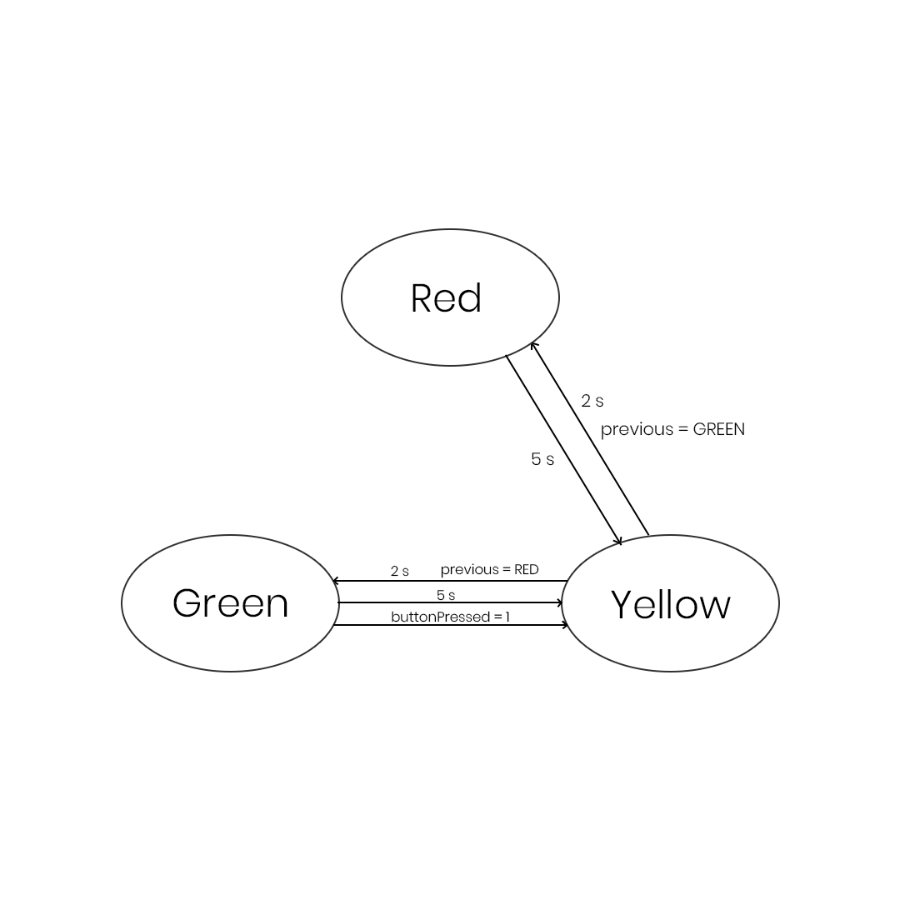

# STM32 Traffic Light Controller 

A traffic light controller implemented using the STM32F401RE Nucleo board and STM32 HAL libraries.

The project demonstrates fundamental embedded systems concepts including GPIO, external interrupts, finite state machines, non-blocking timing, and software debouncing.

## Overview

This project implements a simple traffic light system using three LEDs:

- 🔴 Red
- 🟡 Yellow
- 🟢 Green

(in the hardware implementation the 3 color LEDs are all represented using red LEDs)

The traffic light operates as a finite state machine. A push button connected to an external interrupt can be used to trigger a transition from the green state to the yellow state.

The project was developed using STM32CubeIDE and STM32 HAL.

## Features

- Finite State Machine (FSM) based traffic light control
- Multiple LED control
- Push-button input
- External interrupt using EXTI
- Software button debouncing
- Non-blocking timing using 'HAL_GetTick()'
- STM32 HAL GPIO configuration
- STM32CubeMX configuration through '.ioc' file

## Hardware

- STM32 NUCLEO-F401RE
- LED x 3
- Push button
- 470 Ω resistors x 3
- Jumper wires
- Breadboard

## Circuit Diagram

## Hardware Implementation

## Pin Configuration

|  Component  | STM32 Pin |
|-------------|-----------|
|   Red LED   |    PA5    |
|  Yellow LED |    PA6    |
|  Green LED  |    PA7    |
| Push Button |    PA0    |

The push button uses the STM32's internal pull-up resistor.

Therefore:

|    Button   |  PA0 |
|-------------|------|
| Not pressed | HIGH |
|   Pressed   |  LOW |

## Circuit

The LEDs are connected to GPIO output pins using current-limiting resistors.

The push button is connected between PA0 and GND.
PA0 uses the internal pull-up resistor.

## FSM

The traffic light is implemented as a finite state machine.

RED → YELLOW → GREEN → YELLOW → RED

The YELLOW state uses the previous state to determine whether the next state should be GREEN or RED.

## Non-Blocking Timing

| State | Duration |
|-------|----------|
| RED   | 5 seconds|
| YELLOW| 2 seconds|
| GREEN | 5 seconds|

Timing is implemented using 'HAL_GetTick()' instead of
'HAL_Delay()', allowing the main loop to continue running
while the timer is being checked.

## Button Interrupt

The push button is configured using an EXTI falling-edge interrupt.

When the button is pressed, the interrupt callback sets 'buttonPressed' to 1.

The main FSM then processes this event.

PA0: HIGH → LOW
       ↓
    EXTI0
       ↓
HAL_GPIO_EXTI_Callback()
       ↓
buttonPressed = 1

## Debouncing

Mechanical push buttons can generate multiple transitions
during a single press.

A 50 ms software debounce period is therefore implemented
using 'HAL_GetTick()'.

## Program Flow

              RED
               │
             5 sec
               ↓
            YELLOW
               │
             2 sec
               ↓
             GREEN
               │
        ┌──────┴──────┐
        │             │
      5 sec       Button press
        │             │
        └──────┬──────┘
               ↓
            YELLOW
               │
             2 sec
               ↓
              RED
